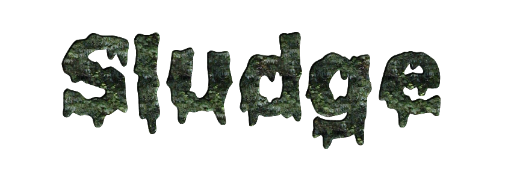
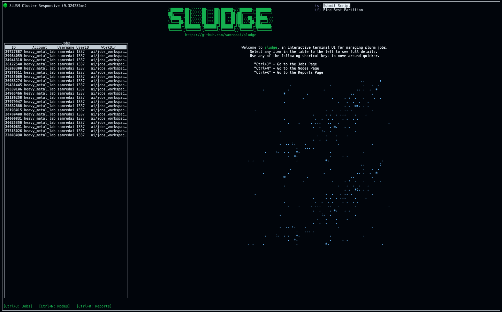
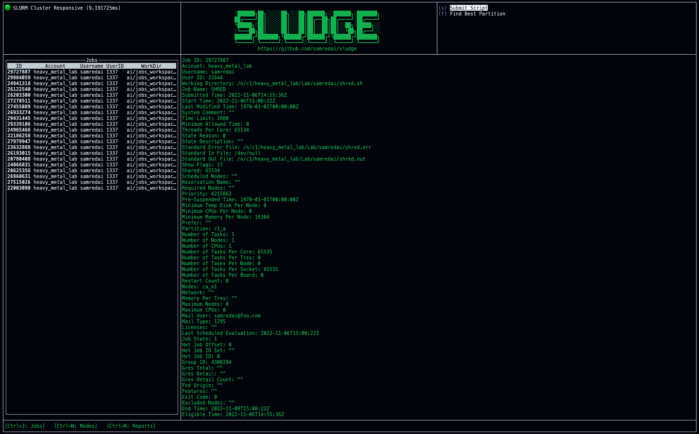
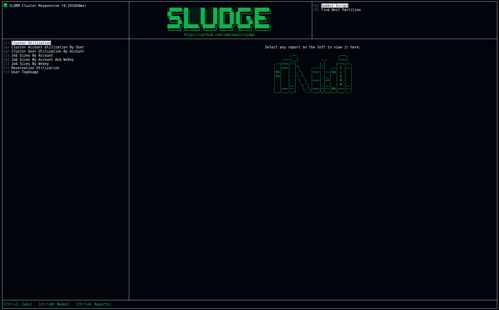
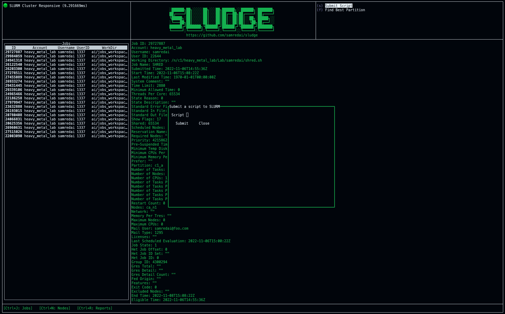
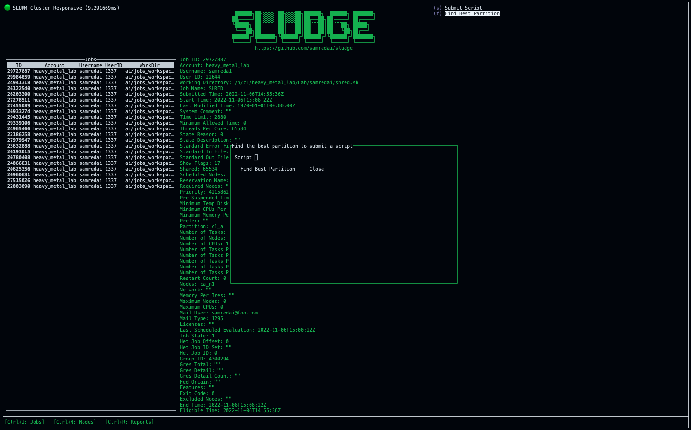

Sludge is a terminal UI for [SLURM](https://slurm.schedmd.com/documentation.html), a cluster management and job scheduling system.
To learn more about it, head over to the [documentation](https://www.sludgeui.com) site.

# Installation

## Linux

Create a `bin` directory and download the sludge binary there.
```sh
mkdir -p $HOME/bin
cd $HOME/bin
wget -P $HOME/bin https://github.com/samredai/sludge/releases/download/0.1.0-alpha.1/sludge-linux-amd64 -O sludge
chmod +x $HOME/bin/sludge
```

Add the bin directory to your `PATH` variable by including the following in your `~/.bashrc` file.
```sh
export PATH=$HOME/bin:$PATH
```

# Usage

The sludge terminal UI can be opened using the `sludge` command.
```sh
sludge
```
[](docs/static/images/welcome-page.png)

The sludge UI can be closed using either `Ctrl+C` or `Ctrl+D`.

## Filtering to a Specific User

The `--username` argument opens sludge with all views filtered to a specific user.
```sh
sludge --username samredai
```

## Filtering to a Specific Account

The `--account` argument opens sludge with all views filtered to a specific account.
```sh
sludge --account heavy_metal_lab
```

## Jobs Page

You can view all jobs on the SLURM cluster by going to the jobs page `[Ctrl+J]`. Selecting a job will reveal more information about the job in the center pane, such as number of nodes, number of CPUs, and the number of threads per core.

[](docs/static/images/job-details.png)

## Nodes Page

You can view all nodes on the SLURM cluster by going to the nodes page `[Ctrl+N]`. Selecting a node will reveal more information about the node in the center pane, such as the architechture, the number of cores and the CPU load.

## Reports Page

Sludge lets you run various reports on the SLURM cluster and displays the results. On the reports page `[Ctrl+R]`, you can select which report you want to run in the left pane. Once the results are ready, they will be displayed in the center pane. The reports are submitted using the `sreport` command line utility that comes with SLURM.

[](docs/static/images/reports-page.png)

# Actions

The actions menus can be found in the top right pane and contains various forms that can be used to run common actions against the SLURM cluster such as submitting a script using `sbatch` or running an analysis to determine the best partition for a particular script.

## Submit Script Action

You can submit a script to run on the SLURM cluster using the `Submit Script` action. In addition to the script name, you can include additional sbatch options as arguments.
See the [sbatch](https://slurm.schedmd.com/sbatch.html) documentation to see all available options.

[](docs/static/images/submit-script-action.png)

## Find Best Partition Action

You can find the SLURM partition with the minimum delay for starting a particular script using the Find Best Partition action. This uses the open source [BestSlurmPartition](https://github.com/fasrc/best_slurm_partition) utility created by the research computing team at the Harvard Faculty of Arts & Sciences (FASRC).

To use the action, simply select it in the actions pane and enter the path to the script you’d like to find the best partition for. Relative paths are calculated from the directory where the sludge UI was launched.

[](docs/static/images/find-best-partition-action.png)
